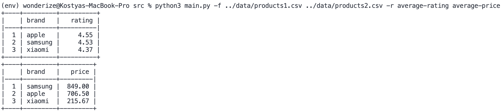

# workmate-test-task

Generates reports based on data provided in CSV files.



## Installation

Create and enter virtual environment

```bash
# macOS
python3 -m venv env && source ./env/bin/activate
```

Install required dependencies

```bash
pip install .
```

Run script

```bash
python3 main.py -f ../../data/products1.csv ../../data/products2.csv -r average-rating average-price
```

Run tests

```bash
pytest tests
```

## Usage

### Options

```bash
usage: products-parser [-h] [-f FILES [FILES ...]] [-r REPORT [REPORT ...]]

Parses CSV and produces reports about some products

options:
  -h, --help            show this help message and exit
  -f, --files FILES [FILES ...]
                        path to files
  -r, --report REPORT [REPORT ...]
                        report type
```

### How to add new report

You can add new report as a function in the `reports.py` file. It will be automatically parsed and then you can use it by passing report name as an argument.

**Note:** report function name must start with the `report` keyword. Also `report` keyword will be deleted after parsing and underscores will be replaced with dashes (e.g. `report_average_rating` will be `average-rating`, `report_average_price` will be `average-price` etc).
